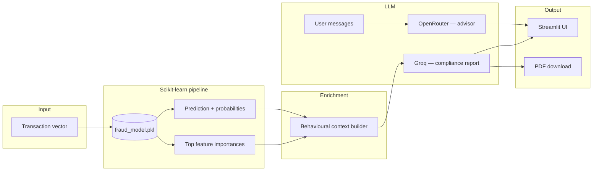

# ShieldPay — Real-Time Credit Card Fraud Detection

**Final Year Project · Nottingham Trent University · BSc (Hons) Computer Science**

ShieldPay is an end-to-end fraud detection platform that scores credit card transactions in real time, explains risk in plain language, and produces compliance-ready incident reports. It combines classical machine learning on imbalanced tabular data with large language models for analyst-facing narrative and a conversational fraud-prevention advisor.

**Author:** [Faiz Lawan](https://github.com/hackerbotfz) · Student ID: N1258521

---

## Overview

Payment fraud costs the global economy billions each year. Financial institutions need systems that flag suspicious transactions quickly while remaining interpretable to compliance and operations teams—not just accurate on a leaderboard.

ShieldPay addresses that gap by:

1. **Scoring** each transaction with a supervised classifier trained on highly imbalanced real-world card data.
2. **Surfacing** fraud probability, confidence, and the strongest behavioural signals driving the decision.
3. **Generating** structured compliance reports via an LLM, written for non-technical stakeholders.
4. **Exporting** those reports as PDFs suitable for audit trails.
5. **Offering** an embedded fraud-prevention advisor for education and operational Q&A.

The application is delivered as a polished **Streamlit** web interface with light/dark themes and a workflow modelled on how fraud analysts actually review cases.

---

## Features

| Capability | Description |
|------------|-------------|
| **Real-time inference** | Sub-second classification on 30-dimensional transaction vectors (time, amount, PCA-derived features). |
| **Sample & custom inputs** | Pre-loaded fraudulent and legitimate examples from the test set, plus procedurally generated custom transactions. |
| **Risk visualisation** | Verdict banner, confidence bar, fraud probability, and amount/time summary cards. |
| **Behavioural context** | Rule-based enrichment (card-testing patterns, off-hours activity, anomaly counts) fed into report generation. |
| **AI compliance reports** | Five-section incident write-ups (executive summary through recommended actions) via Groq. |
| **PDF export** | Branded, timestamped reports using `fpdf2`. |
| **Fraud Prevention Advisor** | Domain-scoped chat assistant (OpenRouter) covering scams, PSD2, GDPR, and mitigation practices. |

---

## Architecture



**Data:** Transactions follow the structure of the [ULB MLG Credit Card Fraud](https://www.kaggle.com/datasets/mlg-ulb/creditcardfraud) dataset—`Time`, `Amount`, and 28 PCA components (`V1`–`V28`) preserving anonymity while retaining predictive signal.

**Model:** A tree-based ensemble (exported via `joblib`) trained with class-imbalance handling (`imbalanced-learn`). The serialized bundle includes the fitted estimator, feature column order, and optional evaluation metadata.

---

## Tech stack

- **Python 3.10+**
- **Streamlit** — application shell and UI
- **scikit-learn** + **imbalanced-learn** — modelling and resampling
- **pandas** / **numpy** / **joblib** — data handling and persistence
- **Groq API** — fast report generation (Llama 3.1)
- **OpenRouter API** — fraud-prevention advisor
- **fpdf2** — PDF generation
- **requests** — HTTP client for advisor

---

## Getting started

### Prerequisites

- Python 3.10 or newer
- API keys (optional but required for full functionality):
  - [Groq](https://console.groq.com/) — compliance reports
  - [OpenRouter](https://openrouter.ai/) — fraud advisor chat

### Installation

```bash
git clone https://github.com/hackerbotfz/FYP.git
cd FYP

python -m venv .venv

# Windows
.venv\Scripts\activate

# macOS / Linux
source .venv/bin/activate

pip install -r requirements.txt
```

### Model artifact

The trained classifier is distributed as `fraud_model.zip` in the repository. Extract it in the project root:

```bash
# Windows (PowerShell)
Expand-Archive -Path fraud_model.zip -DestinationPath .

# macOS / Linux
unzip fraud_model.zip
```

You should have `fraud_model.pkl` alongside `app.py`. The app will not start without this file.

### Environment variables

Copy the example file and add your keys:

```bash
cp .env.example .env
```

| Variable | Purpose |
|----------|---------|
| `GROQ_API_KEY` | Compliance report generation |
| `OPENROUTER_API_KEY` | Fraud Prevention Advisor |

Never commit `.env` or paste keys into source code.

### Run the application

```bash
streamlit run app.py
```

Open the URL shown in the terminal (default `http://localhost:8501`).

---

## Usage

1. **Load a sample** — use *Sample Transaction A* (fraudulent) or *Sample Transaction B* (legitimate), or *Custom Transaction* for a synthetic vector.
2. **Adjust** `Time` and `Amount` if needed, then click **Run Analysis**.
3. Review the verdict, fraud probability, and confidence.
4. Click **Generate Compliance Report** for a narrative suitable for compliance review.
5. **Download as PDF** to archive or share.
6. Open **Advisor** in the nav bar to ask questions about fraud prevention, regulation, or consumer protection.

---

## Model performance

Hold-out test metrics from the trained `RandomForestClassifier` (200 estimators, SMOTE on training split, `class_weight='balanced'`):

| Metric | Score |
|--------|-------|
| F1 | 0.827 |
| Precision | 0.881 |
| Recall | 0.779 |
| ROC AUC | 0.963 |

## Project structure

```
FYP/
├── app.py              # Streamlit application (UI, inference, LLM, PDF)
├── requirements.txt    # Python dependencies
├── fraud_model.zip     # Serialized classifier (extract → fraud_model.pkl)
├── .env.example        # API key template
├── docs/               # Screenshot guide for README
├── SECURITY.md         # API key rotation and local secrets
├── .gitignore
└── README.md
```

---

## Academic context

This repository implements the software component of a Final Year Project at **Nottingham Trent University**. The work demonstrates:

- Handling **severe class imbalance** in fraud detection
- Building **production-style** interactive tooling around an ML model
- **Human-in-the-loop** design: ML for scoring, LLMs for explanation and education
- Awareness of **regulatory and operational** constraints (compliance language, PDF audit trails)

A full dissertation (`N1258521 Dissertation FYP.docx`) accompanies the submission; methodology, evaluation metrics, and ethical considerations are documented there.

---

## Screenshots

Visual previews can be added under `docs/` — see [docs/SCREENSHOTS.md](docs/SCREENSHOTS.md) for capture steps and README markup.

## Security

API keys must be supplied via environment variables only. See [SECURITY.md](SECURITY.md) for key rotation steps if older commits exposed credentials.

---

## License

Academic work — © Faiz Lawan, Nottingham Trent University. Contact the author for reuse beyond educational reference.

---

## Acknowledgements

- [ULB MLG — Credit Card Fraud Detection](https://www.kaggle.com/datasets/mlg-ulb/creditcardfraud) dataset
- Nottingham Trent University supervisors and module staff
- [Groq](https://groq.com/) and [OpenRouter](https://openrouter.ai/) for LLM APIs used in the demonstration layer
