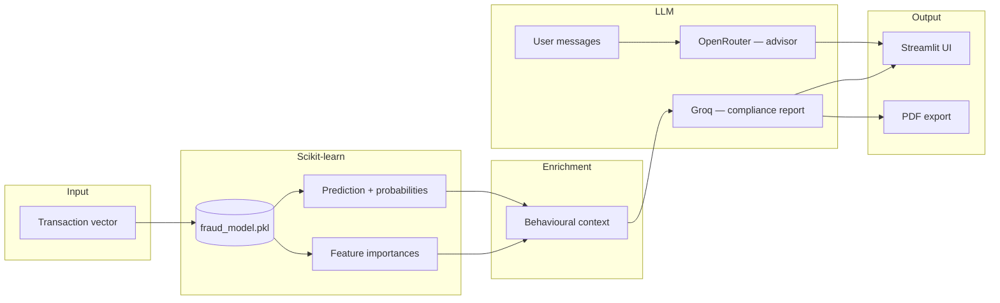

<div align="center">

# Aegis

### Real-time credit card fraud detection

[](https://www.ntu.ac.uk/)
[](https://www.python.org/)
[](https://streamlit.io/)
[](https://scikit-learn.org/)
[](https://pandas.pydata.org/)

<br/>

[]()
[]()
[]()
[]()

<br/>

[](https://groq.com/)
[](https://openrouter.ai/)
[]()

<br/>

[](https://github.com/hackerbotfz/FYP/commits)
[](https://github.com/hackerbotfz/FYP)
[](https://github.com/hackerbotfz/FYP/stargazers)

<br/>

**[Faiz Lawan](https://github.com/hackerbotfz)** · N1258521 · BSc (Hons) Computer Science

</div>

---

Aegis scores credit card transactions in real time, surfaces fraud probability and behavioural signals, and produces compliance-ready incident reports with PDF export. A domain-scoped fraud-prevention advisor sits alongside the analyst workflow.

## Overview

Financial fraud detection must balance accuracy with interpretability for compliance and operations teams. Aegis combines a **Random Forest** classifier on severely imbalanced transaction data with **LLM-generated** narrative reports and a conversational advisor—delivered through a **Streamlit** interface with light/dark themes.

| Layer | Role |
|-------|------|
| **ML** | Real-time classification on 30 features (`Time`, `Amount`, PCA components `V1`–`V28`) |
| **Enrichment** | Rule-based behavioural context (card-testing patterns, off-hours activity, signal anomalies) |
| **LLM** | Structured compliance reports (Groq / Llama 3.1) and fraud-prevention Q&A (OpenRouter) |
| **Export** | Timestamped PDF incident reports |

## Architecture



Trained on the [ULB MLG Credit Card Fraud](https://www.kaggle.com/datasets/mlg-ulb/creditcardfraud) dataset—284,807 transactions, 0.172% fraud rate—with **SMOTE** resampling and `class_weight='balanced'` on a 200-tree ensemble.

## Model performance

| Metric | Score |
|--------|-------|
| F1 | 0.827 |
| Precision | 0.881 |
| Recall | 0.779 |
| ROC AUC | 0.963 |

## Run

```bash
pip install -r requirements.txt
unzip fraud_model.zip    # Windows: Expand-Archive fraud_model.zip
streamlit run app.py
```

`GROQ_API_KEY` and `OPENROUTER_API_KEY` enable report generation and the advisor chat.

## Repository

```
FYP/
├── app.py
├── requirements.txt
├── fraud_model.zip
└── README.md
```

## License

© Faiz Lawan, Nottingham Trent University.
